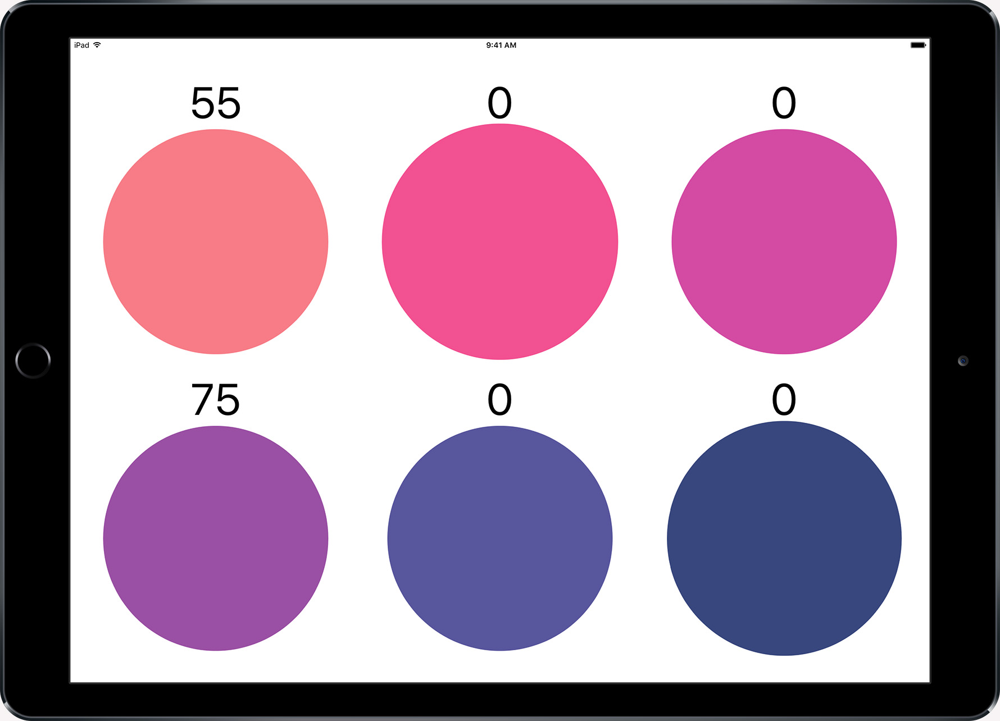

# Realm Crowd Circle
> A small demo app designed to demonstrate simple instantaneous collaboration of up to 6 groups in an artistic style game.

One device runs as a "host", which will display circles representing 6 separate clients. Other devices can then connect as clients.
When a client taps on the circle button on their screen, the equivalent circle on the host will increment.
Over time, the values on the host will decrease until they reach 0 again.

# Features
- [x] Works with 1 host iPad and up to 6 iPhone / iPad units.
- [x] Locally hosted; one iPad acts like the host.
- [x] Springy animations to elicit a playful response with users.

# Requirements

- iOS 9.0 and above
- Xcode 8.3
- Realm Platform / Realm Object Server 2.0 and above

### Realm Platform

This application demonstrates features of the [Realm Platform](https://realm.io/products/realm-platform/) and needs to have a working instance of the Realm Object Server version 2 to make data available between instances of the Puzzle app. The Realm Platform can be installed via npm as a node application for macOS or Linux. For installion instructions please check out the [Developer edition installation instructions](https://realm.io/docs/get-started/installation/developer-edition/).

### Realm Studio
Another useful tool is [Realm Studio](https://realm.io/products/realm-studio/) which is available for macOS, Linux, Windows and allows developers to inspect and manage Realms. Realm Studio is recommended for all developers and can be downloaded from the [Realm web site](https://realm.io/products/realm-studio/).

[CocoaPods](http://cocoapods.org/) is required in order to install all of the third party dependencies (such as Realm itself) into Realm Crowd Circle.

1. If you haven't already, [install CocoaPods](https://guides.cocoapods.org/using/getting-started.html).
2. Open Terminal, and navigate to the root Realm Puzzle directory, e.g. `cd ~/Projects/realm-crowdcircle`.
3. Run `pod install` to install the necessary dependencies needed by Realm Crowd Circle.
4. Open Realm Mobile Platform on a local Mac.
5. Create a user in the RMP Dashboard, enter 'crowdcircle@realm.io' and 'password' respectively as username and password.
6. Build the apps and deploy to all devices.

The app will try to insert the correct local IP address at build time, but if that isn't appropriate, it's possible to manually set the host name upon launch as well.

# Third Party Dependencies

The following modules will be installed as part of the CocoaPods installation:

- [Realm Swift](https://realm.io) - The Objective-C version of the Realm Mobile Database.

- [Eureka](https://github.com/xmartlabs/Eureka) - A framework for easily setting up input forms in iOS.

- [SwiftSpinner](https://github.com/TimOliver/SwiftSpinner) - A fullscreen loading spinner UI.

# Contributing

See [CONTRIBUTING.md](CONTRIBUTING.md) for more details!

This project adheres to the [Contributor Covenant Code of Conduct](https://realm.io/conduct/). By participating, you are expected to uphold this code. Please report unacceptable behavior to [info@realm.io](mailto:info@realm.io).

# License

Distributed under the Apache license. See ``LICENSE`` for more information.

